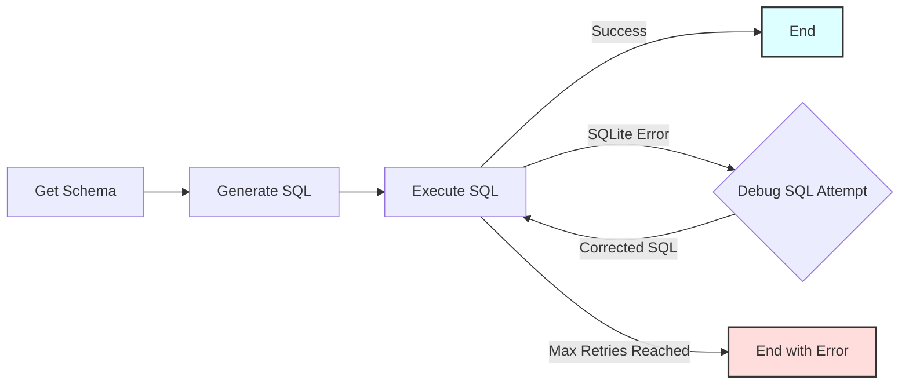

# Text-to-SQL Workflow

Пример PocketFlow, демонстрирующий workflow преобразования текстовых запросов в SQL, который конвертирует вопросы на естественном языке в исполняемые SQL-запросы для базы данных SQLite, включая цикл отладки на основе LLM для неудачных запросов.

- Ознакомьтесь с [Tutorial на Substack](https://zacharyhuang.substack.com/p/text-to-sql-from-scratch-tutorial) для получения дополнительной информации!

## Возможности

-   **Осведомленность о схеме**: Автоматически извлекает схему базы данных для предоставления контекста LLM.
-   **Генерация SQL на основе LLM**: Использует LLM (GPT-4o) для перевода вопросов на естественном языке в SQLite-запросы (используя структурированный вывод YAML).
-   **Автоматизированный цикл отладки**: Если выполнение SQL завершается ошибкой, LLM пытается исправить запрос на основе сообщения об ошибке. Этот процесс повторяется до достижения настраиваемого количества попыток.

## Начало работы

1.  **Установка пакетов:**
    ```bash
    pip install -r requirements.txt
    ```

2.  **Установка API ключа:**
    Установите переменную окружения для вашего OpenAI API ключа.
    ```bash
    export OPENAI_API_KEY="your-api-key-here"
    ```
    *(Замените `"your-api-key-here"` на ваш реальный ключ)*

3.  **Проверка API ключа (опционально):**
    Запустите быструю проверку с помощью утилиты. При успешном выполнении будет выведена короткая шутка.
    ```bash
    python utils/call_llm.py
    ```
    *(Примечание: Для этого требуется установленный действительный API ключ.)*

4.  **Запуск примера по умолчанию:**
    Выполните основной скрипт. Это создаст образец `ecommerce.db`, если он не существует, и запустит workflow с запросом по умолчанию.
    ```bash
    python main.py
    ```
    Запрос по умолчанию:
    > Покажи мне имена и адреса электронной почты клиентов из Нью-Йорка

5.  **Запуск пользовательского запроса:**
    Предоставьте свой собственный запрос на естественном языке в качестве аргументов командной строки после имени скрипта.
    ```bash
    python main.py What is the total stock quantity for products in the 'Accessories' category?
    ```
    Или, для запросов с пробелами, убедитесь, что они обрабатываются как один аргумент оболочкой при необходимости (кавычки могут помочь в зависимости от вашей оболочки):
    ```bash
    python main.py "List orders placed in the last 30 days with status 'shipped'"
    ```

## Как это работает

Workflow использует несколько узлов, соединенных в последовательность, с циклом для отладки неудачных SQL-запросов.



**Описание узлов:**

1.  **`GetSchema`**: Подключается к базе данных SQLite (`ecommerce.db` по умолчанию) и извлекает схему (имена таблиц и столбцов).
2.  **`GenerateSQL`**: Принимает запрос на естественном языке и схему базы данных, запрашивает у LLM генерацию SQLite-запроса (ожидая YAML-вывод с SQL) и парсит результат.
3.  **`ExecuteSQL`**: Пытается выполнить сгенерированный SQL в базе данных.
    *   При успехе результаты сохраняются, и flow завершается успешно.
    *   При возникновении `sqlite3.Error` (например, синтаксическая ошибка) захватывается сообщение об ошибке и запускается цикл отладки.
4.  **`DebugSQL`**: Если `ExecuteSQL` завершился ошибкой, этот узел принимает исходный запрос, схему, неудачный SQL и сообщение об ошибке, запрашивает у LLM генерацию *исправленного* SQL-запроса (снова ожидая YAML).
5.  **(Цикл)**: Исправленный SQL из `DebugSQL` передается обратно в `ExecuteSQL` для еще одной попытки.
6.  **(Условия завершения)**: Цикл продолжается до тех пор, пока `ExecuteSQL` не завершится успешно или не будет достигнуто максимальное количество попыток отладки (по умолчанию: 3).

## Файлы

-   [`main.py`](./main.py): Точка входа для запуска workflow. Обрабатывает аргументы командной строки для запроса.
-   [`flow.py`](./flow.py): Определяет PocketFlow `Flow`, соединяющий различные узлы, включая логику цикла отладки.
-   [`nodes.py`](./nodes.py): Содержит классы `Node` для каждого шага (`GetSchema`, `GenerateSQL`, `ExecuteSQL`, `DebugSQL`).
-   [`utils.py`](./utils.py): Содержит минимальную утилиту `call_llm`.
-   [`populate_db.py`](./populate_db.py): Скрипт для создания и заполнения образца базы данных SQLite `ecommerce.db`.
-   [`requirements.txt`](./requirements.txt): Список зависимостей пакетов Python.
-   [`README.md`](./README.md): Этот файл.

## Пример вывода (успешный запуск)

```
=== Starting Text-to-SQL Workflow ===
Query: 'total products per category'
Database: ecommerce.db
Max Debug Retries on SQL Error: 3
=============================================

===== DB SCHEMA =====

Table: customers
  - customer_id (INTEGER)
  - first_name (TEXT)
  - last_name (TEXT)
  - email (TEXT)
  - registration_date (DATE)
  - city (TEXT)
  - country (TEXT)

Table: sqlite_sequence
  - name ()
  - seq ()

Table: products
  - product_id (INTEGER)
  - name (TEXT)
  - description (TEXT)
  - category (TEXT)
  - price (REAL)
  - stock_quantity (INTEGER)

Table: orders
  - order_id (INTEGER)
  - customer_id (INTEGER)
  - order_date (TIMESTAMP)
  - status (TEXT)
  - total_amount (REAL)
  - shipping_address (TEXT)

Table: order_items
  - order_item_id (INTEGER)
  - order_id (INTEGER)
  - product_id (INTEGER)
  - quantity (INTEGER)
  - price_per_unit (REAL)

=====================


===== GENERATED SQL (Attempt 1) =====

SELECT category, COUNT(*) AS total_products
FROM products
GROUP BY category

====================================

SQL executed in 0.000 seconds.

===== SQL EXECUTION SUCCESS =====

category | total_products
-------------------------
Accessories | 3
Apparel | 1
Electronics | 3
Home Goods | 2
Sports | 1

=== Workflow Completed Successfully ===
====================================
```

